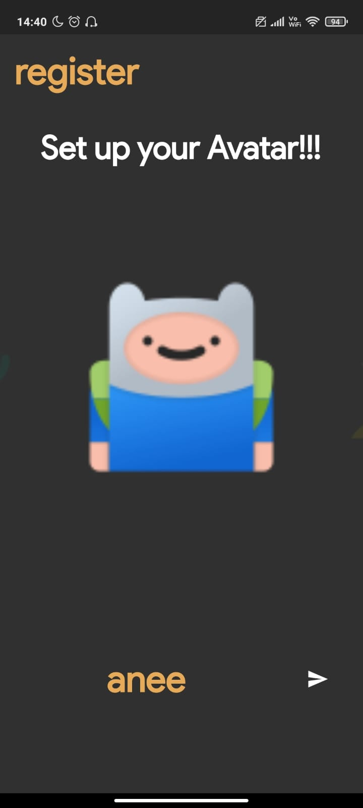

<br />
<p align="center">
  <a href="https://github.com/aneeketMangal/theGameDome">
    
  </a>

  <h2 align="center">The Game Dome</h2>
    <br />
    <p align = "center">
    <a href="https://github.com/aneeketMangal/theGameDome"><strong>Explore the docs »</strong></a>
    <br />
    <a href="https://github.com/github_username/aneeketMangal/issues">Report Bug</a>
    ·
    <a href="https://github.com/github_username/aneeketMangal/issues">Request Feature</a>
  </p>
</p>

<!-- ABOUT THE PROJECT -->

## About The Project

<p align = "center">
<span>
<a href="https://github.com/github_username/repo_name">
    
</span>
<span>
&nbsp;&nbsp;&nbsp;&nbsp;&nbsp;&nbsp;&nbsp;&nbsp;&nbsp;&nbsp;&nbsp;&nbsp;&nbsp;&nbsp;&nbsp;&nbsp;&nbsp;&nbsp;&nbsp;&nbsp;&nbsp;&nbsp;&nbsp;
</span>
<span>
<a href="https://github.com/github_username/repo_name">
    
</span>
</a>
</p>

It is a arcade game collection built using flutter. It has extensive features like user authetication, leaderboard, chat. I have also put in a few animations for enhancement.
Chat feature is implemented using a REST-API created using `Flask`, source code for which is available in the backend folder. User authentication and leaderboard feature are implemented using `sqflite3` and `shared_preferences`.

### Screen Shots

<p align = "center">
<span>

</span>
<span>
&nbsp;&nbsp;&nbsp;&nbsp;&nbsp;&nbsp;&nbsp;&nbsp;&nbsp;&nbsp;&nbsp;&nbsp;&nbsp;&nbsp;&nbsp;&nbsp;&nbsp;&nbsp;&nbsp;&nbsp;&nbsp;&nbsp;&nbsp;
</span>
<span>

</span>
</a>
</p>
<p align = "center">
<span>

</span>
<span>
&nbsp;&nbsp;&nbsp;&nbsp;&nbsp;&nbsp;&nbsp;&nbsp;&nbsp;&nbsp;&nbsp;&nbsp;&nbsp;&nbsp;&nbsp;&nbsp;&nbsp;&nbsp;&nbsp;&nbsp;&nbsp;&nbsp;&nbsp;
</span>
<span>

</span>
</a>
</p>
<p align = "center">
<span>
    
</span>
<span>
&nbsp;&nbsp;&nbsp;&nbsp;&nbsp;&nbsp;&nbsp;&nbsp;&nbsp;&nbsp;&nbsp;&nbsp;&nbsp;&nbsp;&nbsp;&nbsp;&nbsp;&nbsp;&nbsp;&nbsp;&nbsp;&nbsp;&nbsp;
</span>
<span>
    
</span>
</a>
</p>

### Technologies used

- `Flutter`
- `sqflite3`
- `Flask`

<!-- GETTING STARTED -->

### Installation

1. Clone the repo
   ```sh
   git clone https://github.com/aneeketMangal/theGameDome.git
   ```
2. Install dependencies from pubspec.yaml and run the flutter app.

## Contributing

You can contribute to repo by adding new games, introducing a new feature or maybe enhancing the animations. Any contributions you make are **greatly appreciated**.

1. Fork the Project
2. Create your Feature Branch (`git checkout -b feature/AmazingFeature`)
3. Commit your Changes (`git commit -m 'Add some AmazingFeature'`)
4. Push to the Branch (`git push origin feature/AmazingFeature`)
5. Open a Pull Request
